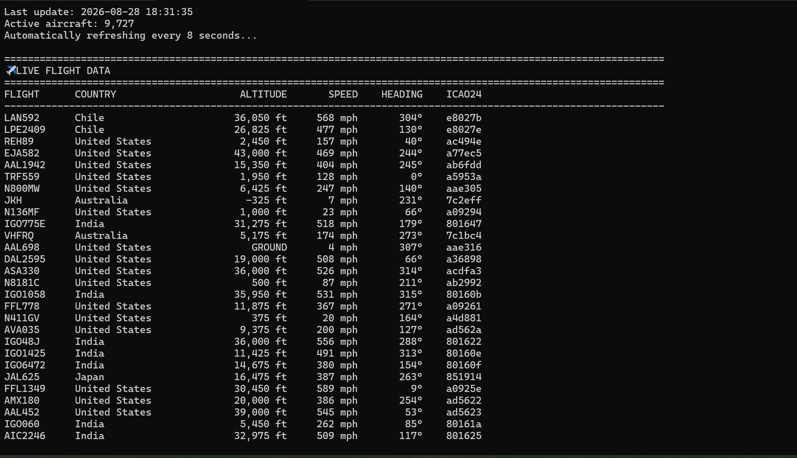

# \# ✈ Real-Time Flight Tracking System


A Python command-line application for monitoring live aircraft state data using the OpenSky Network REST API.


This project demonstrates practical experience with Python programming, REST API integration, JSON data processing, aviation telemetry, geographic calculations, real-time monitoring, and command-line application design.


\## Features


\- Live aircraft state monitoring

\- Displays up to 50 aircraft

\- Automatic live-data refresh

\- Aircraft callsign search

\- Individual aircraft tracking

\- Aircraft filtering by country

\- Highest aircraft ranking

\- Fastest aircraft ranking

\- Geographic aircraft search

\- ICAO24 aircraft identification

\- Altitude conversion to feet

\- Speed conversion to MPH

\- Heading information

\- Vertical climb/descent rate

\- Latitude and longitude

\- Network/API error handling

\- Interactive command-line interface

\- Graceful CTRL+C shutdown


\## Technologies


\- Python 3

\- OpenSky Network REST API

\- JSON

\- HTTP

\- REST APIs

\- Command-Line Interface (CLI)

\- Haversine distance calculation

\- Real-time data processing


\## Data Source


Aircraft state data is provided by the OpenSky Network REST API.


The application retrieves current aircraft state vectors and processes the returned JSON data.


Official OpenSky API documentation:


https://openskynetwork.github.io/opensky-api/


\## Aircraft Data


The application processes several aircraft telemetry fields:


| Data | Description |

|---|---|

| Callsign | Current aircraft flight identifier |

| ICAO24 | 24-bit aircraft transponder address |

| Country | Country associated with the aircraft state |

| Latitude | Current aircraft latitude |

| Longitude | Current aircraft longitude |

| Altitude | Aircraft altitude |

| Velocity | Aircraft ground speed |

| Heading | Aircraft track direction |

| Vertical Rate | Aircraft climb/descent rate |


\## Application Menu


```text

1\. Show flights near me

2\. Search flight by callsign

3\. Track a specific aircraft

4\. Show flights by country

5\. Show highest aircraft

6\. Show fastest aircraft

7\. Automatic live flight data

8\. Exit
```

## Live Demonstration




### Example output

==============================================================

&#x20;              ✈ REAL-TIME FLIGHT TRACKER

==============================================================

1\. Show flights near me

2\. Search flight by callsign

3\. Track a specific aircraft

4\. Show flights by country

5\. Show highest aircraft

6\. Show fastest aircraft

7\. Automatic live flight data

8\. Exit

==============================================================

Select an option:


#### Example Aircraft data

FLIGHT       COUNTRY                  ALTITUDE       SPEED    HEADING

\---------------------------------------------------------------------

AAL123       United States            35,000 ft      487 mph      274°

DAL456       United States            31,000 ft      451 mph       91°

AFR789       France                   38,000 ft      512 mph      180°


## How It Works


The application sends an HTTP request to the OpenSky Network REST API and receives aircraft state data in JSON format.


The program then:


Requests current aircraft state vectors

Parses the JSON response

Extracts aircraft identification and telemetry

Converts measurements into readable units

Filters and sorts aircraft based on user selections

Displays processed data in the terminal

Automatically refreshes data in monitoring mode

Aviation Data Processing


OpenSky provides measurements in metric units. The application converts them into commonly used aviation/U.S. units.


#### Altitude

feet = meters × 3.28084


#### Speed

MPH = meters/second × 2.23694


#### Vertical Rate

ft/min = meters/second × 196.8504


### Geographic Search


The geographic search feature uses the Haversine formula to calculate approximate great-circle distance between a user-provided location and aircraft positions.


This allows the application to identify aircraft within a specified radius.


##### Error Handling

##### 

##### The application handles:


Network connection failures

API request failures

Invalid user input

Missing aircraft telemetry

Aircraft without position data

Aircraft without altitude data

Aircraft without velocity data

Interrupted tracking sessions

Project Goals


##### This project was developed to strengthen practical experience with:


Python programming

REST API integration

JSON data processing

Aviation telemetry

Real-time monitoring

Data filtering and sorting

Geographic calculations

Error handling

CLI application architecture

Future Improvements


##### Potential future development includes:


Interactive aircraft map

Airport proximity detection

Flight-path visualization

Aircraft category identification

Persistent flight history

SQLite database integration

Authenticated API access

Configurable refresh intervals

Unit selection

CSV data export

Web-based dashboard

Aircraft registration lookup


##### **Disclaimer**

##### 

***This project is an educational and portfolio project using publicly available OpenSky Network data.***


***Aircraft availability and telemetry depend on the data provided by OpenSky and its underlying surveillance sources.***


***This application is not intended for operational aviation use.***


***Author***


***Jonathan Kent***


***Computer Science Student | Aviation \& Avionics Technology***


***GitHub:***


***https://github.com/Zed2686***

